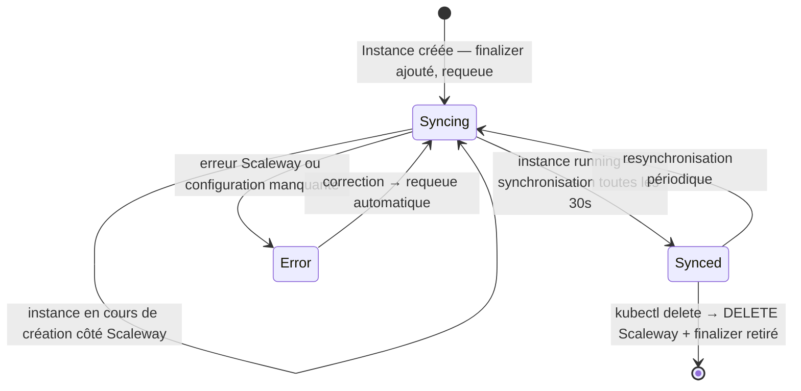

# Scaleway Kubernetes Operator

Un opérateur Kubernetes moderne écrit en **Rust** pour gérer les ressources Scaleway directement depuis Kubernetes.

## 🚀 Fonctionnalités

- ✅ **Gestion complète des instances Scaleway** (CRUD)
- ✅ **Support des projets Scaleway** (via NamespaceRole — voir Prérequis namespace)
- ✅ **Synchronisation automatique** de l'état
- ✅ **Finalizers pour suppression propre**
- ✅ **Validation de configuration**
- ✅ **Logging structuré et tracing**
- ✅ **Multi-zone et multi-région**
- ✅ **Métriques Prometheus** (`/metrics`, `/healthz`, `/readyz`)

## 📋 Prérequis

- Kubernetes 1.35+
- Helm 3.8+ (support des registres OCI requis)
- Token API Scaleway avec les permission sets IAM suivants :
  - `InstancesFullAccess` (scope projet) — créer, lire, supprimer des instances
  - `ProjectReadOnly` (scope organisation) — vérifier l'accès au projet cible

## 🛠️ Installation

Quatre étapes :

1. Déploiement des CustomResourceDefinitions.
2. Fournir les informations de connexion à l'API Scaleway pour l'opérateur.
3. Déploiement de l'opérateur lui-même.
4. Vérifier l'installation.

Ces étapes nécessitent des droits cluster-admin (ou équivalent) sur le cluster cible.

### Prérequis

**Techniques :**

- Kubernetes 1.35+ avec droits cluster-admin
- Helm 3.8+ (support des registres OCI requis)

**Credentials Scaleway :**

Vous aurez besoin de deux valeurs :

- **Token IAM** : Console Scaleway → IAM → Clés API → Créer une clé API.
  Choisir un scope Projet avec les permissions `InstancesFullAccess` + `ProjectReadOnly`.
- **Org UUID** : Console Scaleway → Organisation → Paramètres → Identifiant de l'organisation.

Ces valeurs sont des UUIDs distincts — le token IAM n'est pas l'org UUID.

### 1. Installer les CRDs

```bash
helm upgrade scaleway-operator-crds \
    oci://ghcr.io/mathieubodin/charts/scaleway-operator-crds \
    --version 0.1.10 \
    --namespace scaleway-system \
    --create-namespace \
    --install  # crds
```

### 2. Configurer les informations de connexion de l'opérateur

Créez un secret contenant le token Scaleway et l'organisation. Évitez d'écrire le token directement dans la commande (il apparaîtrait dans l'historique shell) :

```bash
# MY_SCW_TOKEN  : token IAM Scaleway (depuis IAM → Clés API)
# MY_SCW_ORG_ID : UUID organisation Scaleway (depuis Organisation → Paramètres)
kubectl -n scaleway-system create secret generic scaleway-credentials \
    --from-literal=SCALEWAY_TOKEN=$MY_SCW_TOKEN \
    --from-literal=SCALEWAY_ORG_ID=$MY_SCW_ORG_ID \
    --dry-run=client -o yaml | kubectl apply -f -
```

Les variables `$MY_SCW_TOKEN` et `$MY_SCW_ORG_ID` doivent être définies dans votre shell (voir Prérequis ci-dessus). La commande est idempotente : réexécutable sans erreur `AlreadyExists`.

### 3. Déployer l'opérateur

```bash
helm upgrade scaleway-operator \
    oci://ghcr.io/mathieubodin/charts/scaleway-operator \
    --version 0.1.9 \
    --namespace scaleway-system \
    --install \
    --set scaleway.existingSecret=scaleway-credentials  # operator
```

### 4. Vérifier l'installation

```bash
# Vérifier que les CRDs sont installées
kubectl get crd | grep scaleway

# Vérifier que l'opérateur tourne
kubectl -n scaleway-system get deployment
kubectl -n scaleway-system logs -f deployment/scaleway-operator
```

```bash
# Vérifier l'état de santé de l'opérateur
kubectl port-forward -n scaleway-system deployment/scaleway-operator 8080:8080 &
curl -s http://localhost:8080/readyz
# → doit retourner 200 OK (attendre ~30s au démarrage)
# → si 503 persiste après 60s :
#    (a) Pod vient de démarrer, heartbeat pas encore tické — attendre 30s
#    (b) Pod en crashloop — vérifier : kubectl logs -n scaleway-system deployment/scaleway-operator
#    (c) Token invalide — vérifier les logs d'erreur
```

## 📖 Utilisation

Pour utiliser l'opérateur, il faut préparer le namespace qui sera le pendant du projet Scaleway dans le cluster.

### Préparer le projet Scaleway

Chaque namespace Kubernetes correspond à un projet Scaleway. L'opérateur s'authentifie auprès de l'API Scaleway avec une IAM Application scopée à ce projet.

**1. Créer ou identifier un projet Scaleway**

Dans la console Scaleway : **Projects** → sélectionner ou créer un projet.
Notez le **Project UUID** (visible dans les paramètres du projet, sous "Project ID").

**2. Créer une IAM Application**

Dans la console Scaleway : **IAM** → **Applications** → **Créer une application**.

- Donnez-lui un nom explicite (ex. : `k8s-operator-production`)
- Notez son ID

**3. Créer une policy et l'attacher à l'application**

IAM → **Policies** → **Créer une policy** :

| Scope | Permission set |
| --- | --- |
| Projet cible | `InstancesFullAccess` |
| Organisation | `ProjectReadOnly` |

Attachez cette policy à l'application créée à l'étape précédente.

**4. Créer une clé API pour l'application**

IAM → Applications → votre application → **Clés API** → **Créer une clé API**.
Notez la **clé secrète** (affichée une seule fois).

### Préparer le namespace du projet

Trois ressources sont nécessaires pour chaque namespace hébergeant des `Instance`.

**1. Créer le namespace avec l'annotation de projet**

```bash
kubectl create namespace production
kubectl annotate namespace production \
  scaleway.mathieubodin.io/project-id="<project-uuid>"
```

**2. Créer le NamespaceRole**

```yaml
apiVersion: scaleway.mathieubodin.io/v1
kind: NamespaceRole
metadata:
  name: production       # doit correspondre exactement au nom du namespace
spec:
  namespace: production
  scaleway_role: Editor  # Editor ou Admin pour créer des instances
```

```bash
kubectl apply -f namespacerole.yaml
```

**3. Créer le Secret IAM dans scaleway-system**

```bash
# SCW_SECRET_KEY : clé secrète de l'IAM Application (étape 4 ci-dessus)
kubectl -n scaleway-system create secret generic scaleway-ns-creds-production \
  --from-literal=secret_key="$SCW_SECRET_KEY" \
  --dry-run=client -o yaml | kubectl apply -f -
```

> Ce Secret est provisionné hors-bande par un admin. L'opérateur le lit mais ne le crée pas.

### Créer une instance

Le `project_id` et les credentials sont lus automatiquement depuis le namespace (annotation `scaleway.mathieubodin.io/project-id` et Secret `scaleway-ns-creds-{namespace}`). Ne les mettez pas dans le spec de l'Instance.

```yaml
apiVersion: scaleway.mathieubodin.io/v1
kind: Instance
metadata:
  name: my-web-server
  namespace: production     # Le namespace doit avoir l'annotation et le NamespaceRole
spec:
  name: web-server-prod
  zone: fr-par-1
  image: ubuntu-jammy
  instance_type: GP1-M
  tags:
    - prod
    - web
```

```bash
kubectl apply -f instance.yaml
```

### Vérifier le statut

```bash
# Lister les instances
kubectl get instances

# Détails complets
kubectl describe instance my-web-server

# Voir le statut en temps réel
kubectl get instances -w
```

### Supprimer une instance

```bash
kubectl delete instance my-web-server
```

L'opérateur supprimera automatiquement l'instance Scaleway correspondante.

## 🎓 Tutoriel : déployer une instance de bout en bout

Ce tutoriel illustre le cycle de vie complet d'une instance gérée par l'opérateur : setup du namespace, création, synchronisation d'état, et suppression propre.

### 1. Préparer le namespace

Chaque namespace hébergeant des `Instance` nécessite trois ressources. Créez un fichier `production-setup.yaml` :

```yaml
# 1/3 — Namespace avec l'ID du projet Scaleway cible
apiVersion: v1
kind: Namespace
metadata:
  name: production
  annotations:
    scaleway.mathieubodin.io/project-id: "<votre-project-id>"

---
# 2/3 — NamespaceRole : détermine le rôle IAM de l'opérateur pour ce namespace
# Convention : le nom doit correspondre exactement au nom du namespace
apiVersion: scaleway.mathieubodin.io/v1
kind: NamespaceRole
metadata:
  name: production
spec:
  namespace: production
  scaleway_role: Editor   # Editor, Admin ou Viewer — voir section Rôles

---
# 3/3 — Secret IAM pré-provisionné par un admin (hors-bande)
# Nom : scaleway-ns-creds-{nom-du-namespace}, dans le namespace scaleway-system
apiVersion: v1
kind: Secret
metadata:
  name: scaleway-ns-creds-production
  namespace: scaleway-system
stringData:
  secret_key: "<clé-secrète-IAM-Application-scopée-au-projet>"
```

```bash
kubectl apply -f production-setup.yaml
```

> **Pourquoi un Secret séparé ?**
> L'opérateur ne crée aucune ressource IAM côté Scaleway. Un admin provisionne une IAM Application avec `InstancesFullAccess` sur le projet cible, puis stocke sa clé dans ce Secret. L'opérateur est strictement lecteur sur ses prérequis.

### 2. Créer l'instance

Créez `web-server.yaml` :

```yaml
apiVersion: scaleway.mathieubodin.io/v1
kind: Instance
metadata:
  name: web-server
  namespace: production
spec:
  name: web-server-prod   # nom visible dans la console Scaleway
  zone: fr-par-1
  image: ubuntu-jammy
  instance_type: GP1-M
  tags:
    - prod
    - web
```

```bash
kubectl apply -f web-server.yaml
```

### 3. Suivre le cycle de vie

L'opérateur fait progresser l'instance à travers plusieurs états :



Observez l'évolution en temps réel :

```bash
kubectl get instances -n production -w
```

Sortie typique :

```text
NAME         SCALEWAY ID                            STATE      IP
web-server                                          unknown              ← finalizer ajouté, requeue
web-server   12345678-abcd-efgh-ijkl-123456789012   creating             ← instance créée côté Scaleway
web-server   12345678-abcd-efgh-ijkl-123456789012   running    51.15.X.X ← synchronisée
```

### 4. Inspecter l'état

```bash
# Vue synthétique
kubectl get instance web-server -n production

# Détails complets avec events
kubectl describe instance web-server -n production
```

La section `Status` affiche :

```yaml
Status:
  Scaleway Id:  12345678-abcd-efgh-ijkl-123456789012
  State:        running
  Public Ip:    51.15.X.X
  Sync State:   Synced
```

### 5. Supprimer l'instance

```bash
kubectl delete instance web-server -n production
```

L'opérateur :

1. Détecte le `deletionTimestamp` positionné par Kubernetes
2. Appelle `DELETE` sur l'API Scaleway — l'instance cloud est supprimée
3. Retire le finalizer `scaleway.mathieubodin.io/instance-finalizer`
4. Kubernetes supprime l'objet `Instance`

L'instance Scaleway est toujours supprimée **avant** que Kubernetes ne retire la ressource, garantissant l'absence de ressources orphelines.

---

## 🔧 Configuration avancée

### Configuration réseau

```yaml
spec:
  network:
    public_ip: true        # Assigner une IP publique
    enable_ipv6: true      # Activer IPv6
```

### Configuration de sécurité

```yaml
spec:
  security:
    enable_firewall: true  # Activer le firewall
```

### Taille personnalisée du volume

```yaml
spec:
  boot_volume_size: 100    # En GB (défaut: 20)
```

## 📊 Monitoring

L'opérateur expose un serveur HTTP sur le port `8080` avec les endpoints suivants :

| Endpoint | Description |
| --- | --- |
| `/healthz` | Liveness — retourne 200 tant que le process est vivant |
| `/readyz` | Readiness — retourne 200 si le controller loop est actif, 503 sinon |
| `/metrics` | Métriques Prometheus (format text `text/plain; version=0.0.4`) |
| `/log-level` | Niveau de log courant (lecture seule) |

### Accès local aux endpoints

```bash
kubectl port-forward -n scaleway-system deployment/scaleway-operator 8080:8080

curl http://localhost:8080/healthz   # → ok
curl http://localhost:8080/readyz    # → 200 ou 503
curl http://localhost:8080/metrics   # → métriques Prometheus
```

### Métriques exposées

| Métrique | Type | Description |
| --- | --- | --- |
| `scaleway_operator_reconcile_errors_total{error_variant}` | Counter | Erreurs de réconciliation par type |
| `scaleway_operator_reconcile_duration_seconds{outcome}` | Histogram | Durée des cycles de réconciliation |

### Logs de l'opérateur

```bash
kubectl -n scaleway-system logs -f deployment/scaleway-operator
```

## 🐛 Troubleshooting

### Instance n'est pas créée

```bash
# Vérifier les logs
kubectl -n scaleway-system logs deployment/scaleway-operator | grep ERROR

# Vérifier les events
kubectl describe instance my-instance
```

### Erreur: "No NamespaceRole found for namespace"

Le namespace n'a pas de ressource `NamespaceRole` associée. Créez-en une dont le `metadata.name` correspond exactement au nom du namespace (voir la section Préparer le namespace du projet dans le tutoriel).

### Erreur: "Namespace must have annotation scaleway.mathieubodin.io/project-id"

Annotez le namespace avec le projet Scaleway cible :

```bash
kubectl annotate namespace <votre-namespace> \
  scaleway.mathieubodin.io/project-id="<uuid-du-projet>"
```

### Erreur: "Secret scaleway-ns-creds-X not found"

Créez le Secret IAM pré-provisionné pour ce namespace (voir le tutoriel Déployer une instance de bout en bout, étape 1).

### Erreur: "Project access denied"

- Vérifier que l'annotation `scaleway.mathieubodin.io/project-id` du namespace contient le bon UUID
- Vérifier que le token API de l'opérateur a la permission `ProjectReadOnly`
- Vérifier que le projet existe dans Scaleway

### Erreur: "Role X is read-only and cannot create instances"

Le `scaleway_role` du `NamespaceRole` est un rôle en lecture seule. Utilisez `Editor`, `Admin` ou `OrganizationOwner` pour autoriser la création d'instances.

### Erreur: "Invalid zone" ou "Invalid instance type"

Zones valides :

- `fr-par-1`, `fr-par-2` (Paris)
- `nl-ams-1` (Amsterdam)
- `pl-waw-1` (Varsovie)
- `sg-sin-1` (Singapour)
- `it-mil-1` (Milan)

Types valides :

- `DEV1-S`, `DEV1-M`, `DEV1-L`, `DEV1-XL` (développement)
- `GP1-XS`, `GP1-S`, `GP1-M`, `GP1-L`, `GP1-XL` (généraliste)
- `CPU1-XS`, `CPU1-S`, `CPU1-M`, `CPU1-L` (CPU optimisé)
- `GPU-3090`, `GPU-4090` (GPU)

## 🏗️ Architecture

```text
┌─────────────────────────────────────────┐
│   Kubernetes Cluster                    │
│  ┌──────────────────────────────────┐   │
│  │  Scaleway Operator (Rust/kube-rs)│   │
│  │  - Watch Instance CRs            │   │
│  │  - Lit NamespaceRole + annotation│   │
│  │  - Reconcile avec Scaleway API   │   │
│  │  - /healthz /readyz /metrics     │   │
│  └──────────────────────────────────┘   │
└─────────────────────────────────────────┘
         │
         └─► Scaleway API
              - Create/Delete instances
              - Get status
              - Verify project access
```

## 📝 Structure du code

```text
scaleway-operator/
├── src/
│   ├── main.rs          # Point d'entrée
│   ├── error.rs         # Types d'erreur
│   ├── resources.rs     # Définition des CRDs (Instance, NamespaceRole)
│   ├── context.rs       # Contexte partagé + helpers annotations
│   ├── scaleway.rs      # Client Scaleway API
│   ├── reconcilers.rs   # Logique de réconciliation
│   ├── metrics.rs       # Métriques Prometheus (ReconcileOutcome, OperatorMetrics)
│   └── server.rs        # Serveur axum (/healthz, /readyz, /metrics, /log-level)
├── charts/
│   ├── scaleway-operator-crds/   # Chart Helm pour les CRDs
│   └── scaleway-operator/        # Chart Helm pour l'opérateur
├── k8s/
│   ├── crd-instance.yaml         # CRD Instance
│   ├── crd-namespacerole.yaml    # CRD NamespaceRole (cluster-wide)
│   ├── deployment.yaml           # Deployment de l'opérateur
│   └── examples.yaml             # Exemples d'utilisation
├── Cargo.toml           # Dépendances Rust
├── Dockerfile           # Image Docker
└── README.md            # Ce fichier
```

## 🚀 Développement

### Build local

```bash
cargo build --release
# ou via Make :
make build
```

### Tests

```bash
cargo test
# ou avec coverage :
make coverage-json
```

### Format et lint

```bash
cargo fmt && cargo clippy
# ou via Make :
make check
```

## 📝 Roadmap

- [ ] Support des Load Balancers
- [ ] Support du Object Storage
- [ ] Support des bases de données managées
- [ ] Webhooks de validation avancée
- [ ] UI Web pour le management
- [ ] Support des snapshots
- [ ] Auto-scaling basé sur métriques

## 📄 Licence

MIT

## 🤝 Contribution

Les contributions sont bienvenues ! N'hésitez pas à ouvrir des issues ou PRs.

## 📞 Support

Pour toute question ou problème :

1. Vérifiez la documentation ci-dessus
2. Consultez les logs de l'opérateur
3. Ouvrez une issue sur le dépôt

## 🔗 Ressources

- [Documentation Scaleway API](https://developers.scaleway.com/)
- [Kube-rs - Rust Kubernetes client](https://kube.rs/)
